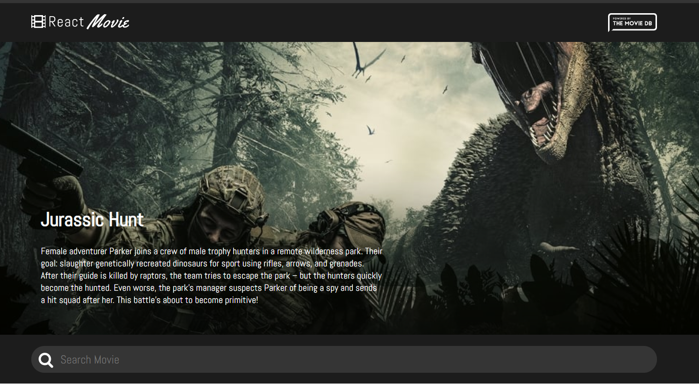

<h1 align="center">React Movie DB</h1>

  <h3>
    <a href="https://focused-euclid-b04e3f.netlify.app/">
      Demo
    </a>
  </h3>

<!-- TABLE OF CONTENTS -->

## Table of Contents

- [Overview](#overview)
  - [Built With](#built-with)
- [Features](#features)
- [Contact](#contact)

<!-- OVERVIEW -->

## Overview

- Where can I see your demo?
- You can see it by clicking this address.(https://focused-euclid-b04e3f.netlify.app/)
- What was your experience?
- I have completely built a page on my own and have practiced my knowledge
- What have you learned/improved?
- Reinforced my JS, React, HTML, CSS knowledge

### Built With

<!-- This section should list any major frameworks that you built your project using. Here are a few examples.-->

- [HTML](https://html.com/)
- [CSS](https://www.w3.org/Style/CSS/)
- [JS](https://www.javascript.com/)
- [React](https://reactjs.org/)

## Contact

- Website [altananil.com](http://altananil.com/)
- GitHub [@anilaltan](https://github.com/anilaltan)
- Twitter [@altn_anl](https://twitter.com/altn_anl)
